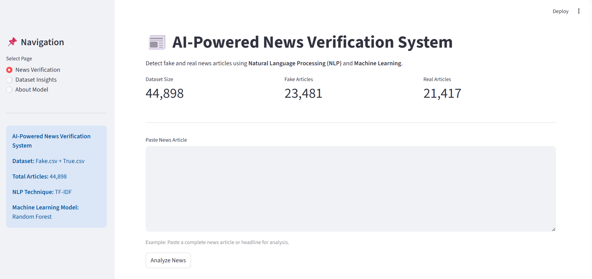
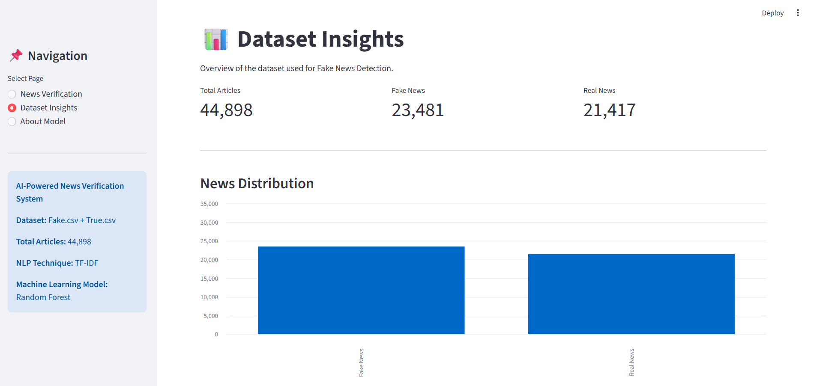
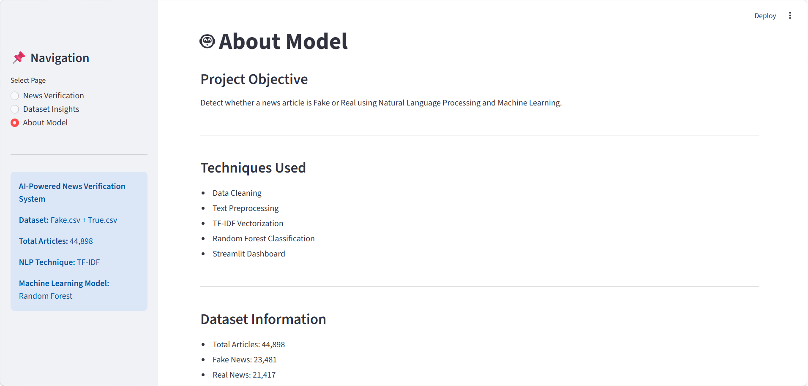
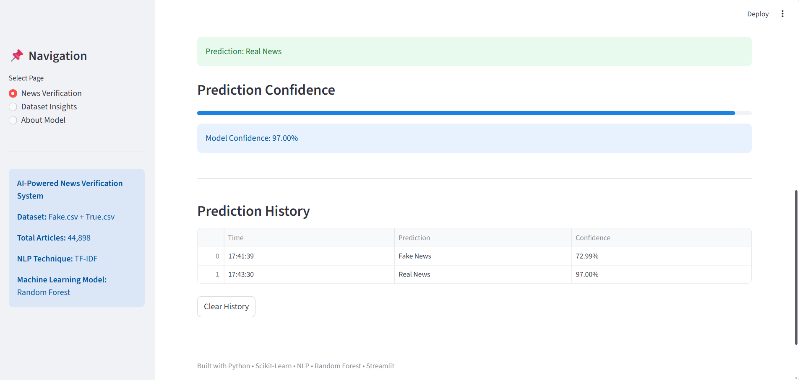

# 📰 AI-Powered News Verification System

## 📌 Overview

AI-Powered News Verification System is an NLP-based machine learning application that classifies news articles as **Fake News** or **Real News** using **TF-IDF Vectorization** and a **Random Forest Classifier**.

The project demonstrates the complete machine learning workflow, including data preprocessing, feature engineering, model comparison, evaluation, and deployment through an interactive Streamlit dashboard.

---

## 🎯 Business Problem

The rapid growth of digital media has increased the spread of misinformation and fake news across online platforms. Identifying trustworthy information manually can be time-consuming and challenging.

This project aims to automate the verification of news articles using Natural Language Processing (NLP) and Machine Learning techniques. By analyzing textual patterns, the system classifies news articles as Fake News or Real News through an interactive Streamlit dashboard.

---

## 🚀 Features

* Real-Time Fake News Detection
* Natural Language Processing (NLP)
* TF-IDF Text Vectorization
* Random Forest Classification
* Prediction Confidence Score
* Prediction Probability Breakdown
* Prediction History Tracking
* Interactive Streamlit Dashboard
* Dataset Insights Dashboard
* Model Information Page

---

## 📊 Dataset

Dataset Files:

* Fake.csv
* True.csv

### Dataset Statistics

| Metric             | Value  |
| ------------------ | ------ |
| Total Articles     | 44,898 |
| Fake News Articles | 23,481 |
| Real News Articles | 21,417 |

---

## 📈 Key Insights

* Dataset contains nearly 45,000 news articles collected from real and fake news sources.
* Fake news articles slightly outnumber real news articles.
* TF-IDF effectively transforms textual information into machine-learning features.
* Random Forest provided the best performance among the evaluated models.
* The dashboard enables users to verify news articles and monitor prediction history interactively.

---

## ⚙️ Machine Learning Pipeline

### 1. Data Collection

* Combined Fake.csv and True.csv datasets.
* Added class labels for supervised learning.

### 2. Data Cleaning

* Removed unnecessary columns.
* Handled missing values.
* Standardized text format.

### 3. Text Preprocessing

* Lowercase conversion
* Punctuation removal
* Text normalization

### 4. Feature Engineering

* TF-IDF Vectorization

### 5. Model Training

The following models were evaluated:

| Model               | Accuracy |
| ------------------- | -------- |
| Logistic Regression | 98.73%   |
| Naive Bayes         | 92.68%   |
| Random Forest       | 99.57%   |

### Selected Model

✅ Random Forest Classifier

The Random Forest model was selected due to its strong performance, robustness, and effectiveness in handling high-dimensional TF-IDF features.

---

## 🖥️ Streamlit Dashboard

The application consists of three main sections:

### 📰 News Verification

* Enter a news article or headline.
* Predict whether the article is Fake or Real.
* View prediction probabilities and confidence scores.

### 📊 Dataset Insights

* Dataset statistics
* News distribution visualization
* Summary metrics

### 🤖 About Model

* Project objective
* Machine learning methodology
* Technology stack
* Dataset information

---

## 🛠️ Tech Stack

### Programming Language

* Python

### Libraries

* Pandas
* NumPy
* Scikit-Learn
* Joblib
* Matplotlib
* Seaborn
* Streamlit

### Machine Learning Techniques

* Natural Language Processing (NLP)
* TF-IDF Vectorization
* Random Forest Classification

---

## 📂 Project Structure

```text
fake_news_detection/

├── app.py
├── README.md
├── requirements.txt

├── model/
│   ├── random_forest_model.pkl
│   └── tfidf_vectorizer.pkl

├── notebook/
│   └── Fake_News_Detection.ipynb

├── screenshots/
│   ├── home.png
│   ├── prediction.png
│   ├── insights.png
│   └── about.png

├── data/
│   ├── Fake.csv
│   └── True.csv
```

## ▶️ Run Locally

### Clone Repository

```bash
git clone https://github.com/your-username/fake-news-detection.git
cd fake-news-detection
```

### Install Dependencies

```bash
pip install -r requirements.txt
```

### Launch Streamlit Application

```bash
streamlit run app.py
```

---

## 📸 Application Preview

### 📰 News Verification Page



### 📊 Dataset Insights Page



### 🤖 About Model Page



### ✅ Prediction Result



---

## 🔮 Future Improvements

* Transformer-Based Models (BERT)
* Explainable AI (SHAP)
* Live News Verification API
* News Source Credibility Scoring
* Cloud Deployment
* Enhanced Interactive Visualizations

---

## 👨‍💻 Author

Developed as an end-to-end NLP and Machine Learning project demonstrating:

* Data Preprocessing
* Text Classification
* Feature Engineering
* Machine Learning Model Development
* Interactive Dashboard Deployment

This project showcases practical applications of NLP and machine learning for automated news verification.
